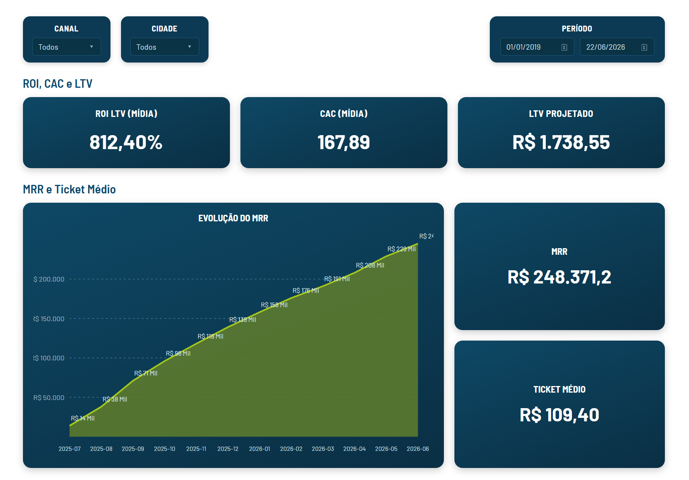
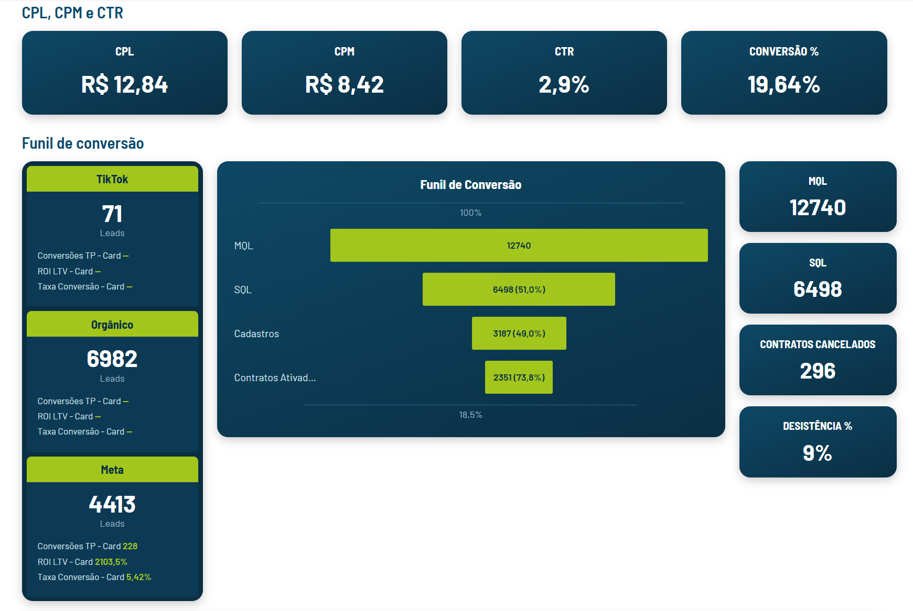

# VIEW MARKETING: Pipeline de Tráfego Pago com Meta Ads API

Dashboard de BI para monitoramento de performance de mídia paga,
cobrindo Meta Ads (Facebook/Instagram) com pipeline de extração via
API, armazenamento em PostgreSQL e visualização em Power BI.

---

## O Problema

A equipe de marketing não tinha visibilidade consolidada dos dados de
tráfego pago. Os números do Meta Ads ficavam presos no Ads Manager,
sem integração com os dados de leads e contratos do sistema interno
(IXC). Não era possível calcular CAC, ROI ou comparar performance por
canal de forma automatizada.

## Dados

- **Meta Graph API v19.0**: investimento, cliques, impressões e
  resultado por campanha, desde 2026-01-01
- **Sistema interno IXC**: leads, contratos e MRR, usados pra cruzar
  com o spend de mídia
- Cobertura final: 9 campanhas extraídas, 2.554 registros históricos

## Tratamento e Modelagem

**Paginação da API:** a API do Meta retorna no máximo 500 registros
por chamada. Sem tratamento de paginação, apenas 7 das 195 campanhas
eram recuperadas. O pipeline implementa loop `while` no cursor
`paging.next` até esgotar os dados.

**Idempotência:** reprocessamentos não geram duplicidade. O
`ON CONFLICT (date_start, campaign_name) DO UPDATE` garante que
rodar o pipeline duas vezes no mesmo dia produz o mesmo resultado.

**Validação:** o spend extraído foi conferido manualmente contra o
Ads Manager da Meta. Diferença final: menos de R$50 em R$115.984 de
investimento no período.

## Tecnologias

| Camada | Tecnologia |
|---|---|
| Extração | Python 3, Requests, python-dotenv |
| Banco de dados | PostgreSQL 14, psycopg2 |
| Ambiente | WSL 2 Ubuntu, venv |
| Modelagem | Power BI Desktop, DAX |
| Fonte de dados | Meta Graph API v19.0 |

## Dashboard

8 canais de aquisição (Meta, Google, TikTok, Orgânico, Indicação,
Hotspot, Campanha Externa, LP Sem Rastreio), funil MQL → SQL →
Contratos e KPIs financeiros (CAC, ROI, LTV, Ticket Médio, MRR).

**Arquitetura desconectada (Rota B):** o slicer de canal não usa
relacionamento direto com a tabela de spend. O roteamento é feito via
`SELECTEDVALUE` + `SWITCH` em DAX, permitindo que cada medida filha
saiba qual canal está selecionado sem depender de relacionamento no
modelo, padrão necessário para cruzar fontes heterogêneas (API de ads
+ sistema IXC).

## Principais Insights

- Pipeline roda diariamente via agendamento, sem intervenção manual
- Dashboard em produção, utilizado pelo time de marketing
- Diferença de validação contra o Ads Manager abaixo de R$50:
  confiabilidade suficiente pra decisão de budget

## Imagens





## Como Reproduzir

```bash
# 1. Clone o repositório
git clone https://github.com/MihrVMF/view-marketing-bi.git
cd view-marketing-bi

# 2. Crie o ambiente virtual e instale dependências
python -m venv venv
source venv/bin/activate
pip install requests psycopg2-binary python-dotenv

# 3. Configure as variáveis de ambiente
cp .env.example .env
# Edite o .env com seus tokens e credenciais

# 4. Execute o extrator
python extratores/meta_extrator.py
```
